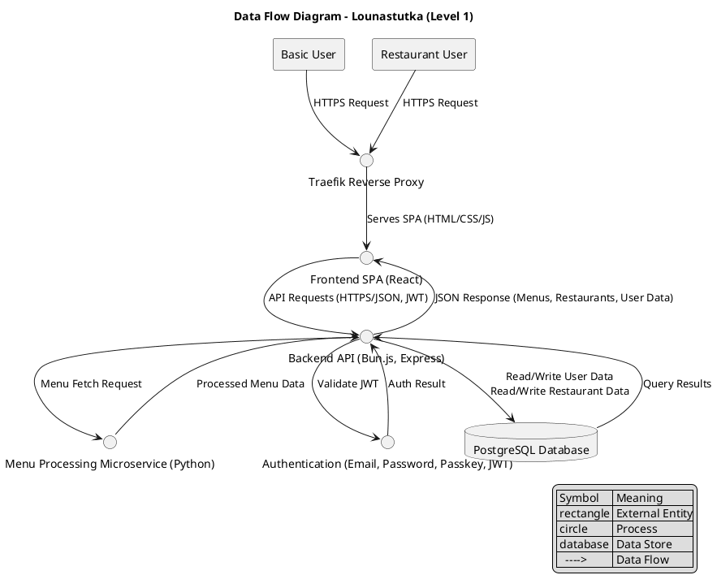

## Data flow diagram

The diagram shows the Data Flow Diagram Level 1 view with the "Yourdon and Coad"-style as descriped in lucidcharts website here: https://www.lucidchart.com/pages/data-flow-diagram

Most of the data flows are bi-directional, and the users interaction with traefik are described only as one-directional due to the initial navigation to the website (SPA frontend) from which the data flows between the software system. Circles are the processes between which data flows in the manner as the arrows describe. Rectangles are the external entities such as users, the github actions could in theory be described here as it is external entity from which data is flowing to the system when updates happen but it is shown in the deployment diagram and felt out of place here. The database is the only data store element within the system.

{ align=left }
