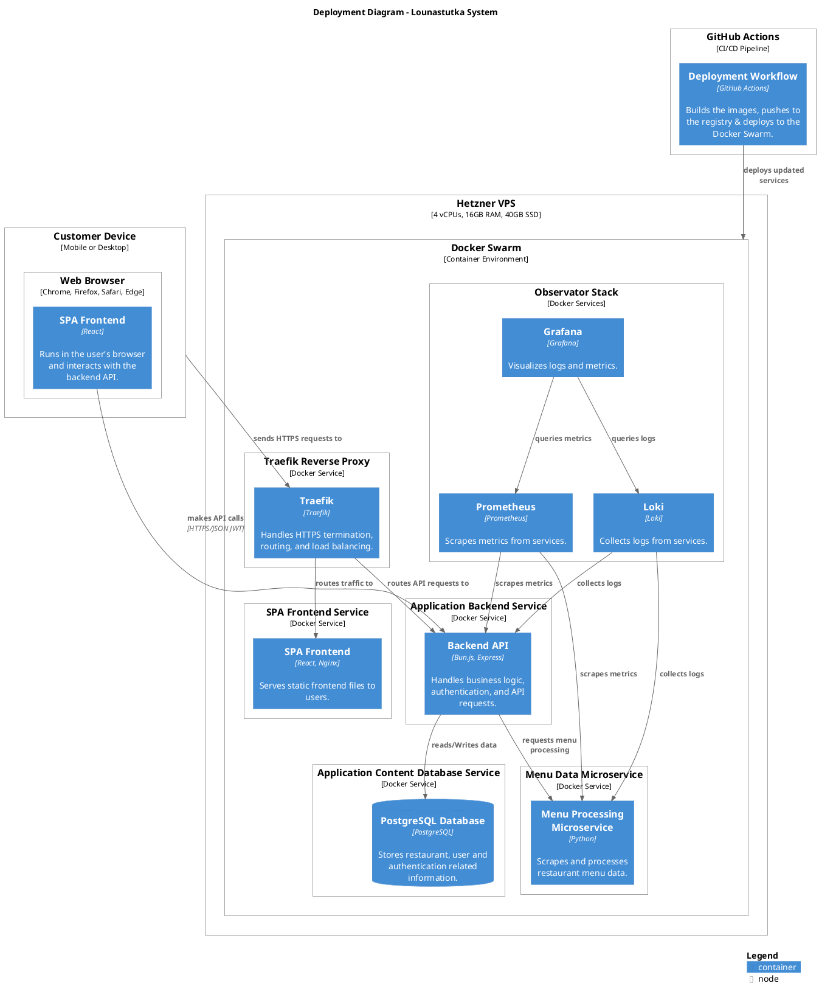

## Deployment diagram

The system with infrastructure services such as Traefik, Grafana, Loki and prometheus frameworks. The internal services are all deployed on a single VPS at Hetzner server farm. The github actions is external system and connects to the internal system via CI/CD pipeline. 

{ align=right}

