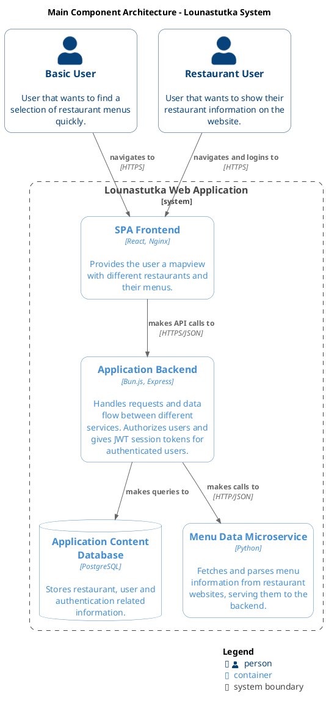

# Microservice architecture

## Purpose

The microservice is responsible for retrieving and generating restaurant and lunch menu data for the Lounastutka system.

It acts as a dedicated data provider between the backend and external (or simulated) data sources.

---

## Responsibilities

* Accept a restaurant URL from the backend
* Return structured restaurant data

---

## Architecture Role

```text
Frontend → Backend → Microservice → Backend → Database → Frontend
```

The microservice is **not exposed publicly** and is only accessible within the Docker network.

---

**Containers:**

- **Basic User:** User that does not necessarly want to login but wants to check local restaurant menus via interactive map.
- **Restaurant User:** User who might want to add their restaurant information on the website for other users to see.
- **Frontend (bunjs nginx react):** Responsible for showing user the main content of the application. This is the service user directly interacts with, others are internal and only accessible through APIs.
- **Backend (bunjs express):** Handles the data flow between frontend, microservices and database.
- **Microservice (python):** Scrapes a website based on the given URL and tries to gather menu data.
- **Database (postgresql):** Stores applications content such as information about the restaurants as well as metadata about the users that want to authenticate. 


{ align=left }


