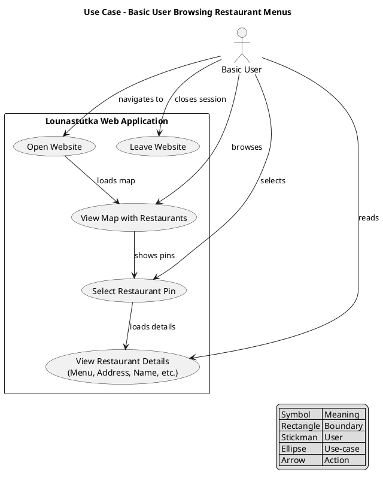
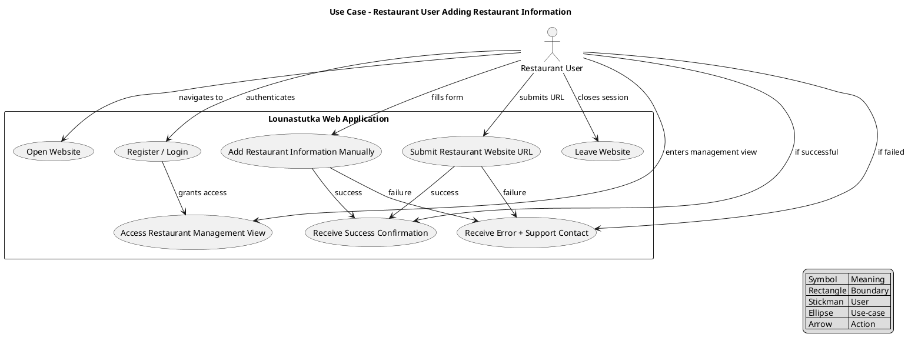

## Use-case diagrams

The application has two distinct use-cases, the basic user use-case where a user wants to just see whats on the menu today on local restaurants and then close the site.

The other more complex use-case is for the restaurant users who might want to add their restaurant information to the website to be seen by the normal users, by either manually typing the information or providing an URL that is used to fetch the information from the restaurants website. As the addition might fail due to errors in dta transfer, the user is given some additional information about the status.

{ align=left }

{ align=left }
